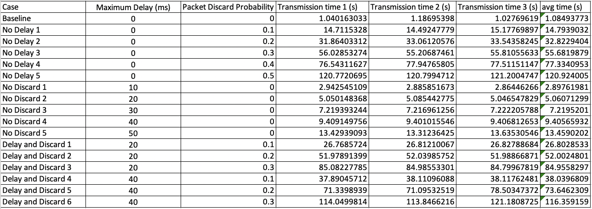

# Experiment Report of Assignment 2 (CS656)
### Jiahao Shi 20683205

## Data and plots
The experiments are proformed on the cs ubuntu server 002, 004, and 008. 

Transmission time of file "small.txt". 

Transmission time of file "medium.txt". 

Transmission time of file "large.txt". 

Average transmission time of three files. 

Plot of average transmission time versus delay and discard probability. 

Plot of average transmission time versus file size. 

## Discussions 
- The transmission time linearly increases with delay. 
- The transmission time exponentially increases with packet discard probabiliy. With the same delay and file size, the transmission time almost doubled when increasing the discard probability by 0.1. 
- The transmission time increases with the file size. The increase is almost linear, but a conclusion cannot be made due to lack of enough data points. 